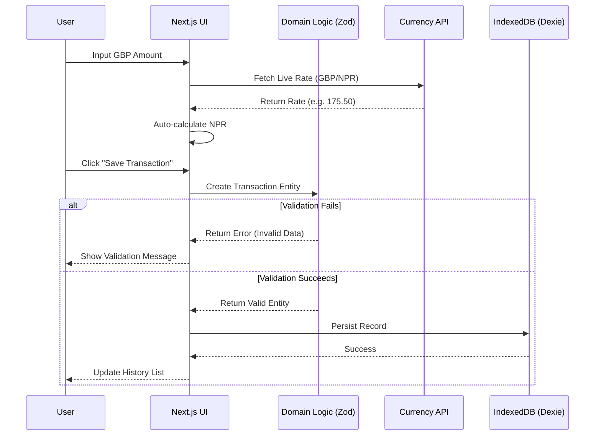

# 💷 Remittance Tracker (GBP ➔ NPR)

A beautiful, mobile-first web application to track money sent from the UK to Nepal. Built with privacy and simplicity in mind.


[](https://scuba3198.github.io/remittance-tracker/)


## ✨ Features

- **🔒 Private & Secure**: All data is stored locally in your browser (IndexedDB). No external servers see your financial data.
- **💱 Live Exchange Rates**: Automatically fetches the latest GBP to NPR exchange rates (with manual override).
- **🌗 Dark Mode**: Beautifully designed interface with automatic light/dark theme switching.
- **📱 Mobile First**: Optimized for seamless use on your phone.
- [x] Data Portability: Export your transaction history to JSON and import it on any device.

## 🏗️ Architecture Data Flow



## 🛠️ Tech Stack

- **Framework**: [Next.js 14](https://nextjs.org/) (App Router)
- **Styling**: [Tailwind CSS](https://tailwindcss.com/) + CSS Variables for Theming
- **Database**: [Dexie.js](https://dexie.org/) (IndexedDB Wrapper)
- **Validation**: [Zod](https://zod.dev/) (Domain-Driven Design)
- **Icons**: [Lucide React](https://lucide.dev/)

## 🚀 Getting Started

### Prerequisites

- Node.js 18+ installed.

### Installation

1.  Clone the repository:
    ```bash
    git clone https://github.com/scuba3198/remittance-tracker.git
    cd remittance-tracker
    ```

2.  Install dependencies:
    ```bash
    npm install
    ```

3.  Run the development server:
    ```bash
    npm run dev
    ```

4.  Open [http://localhost:3000](http://localhost:3000) in your browser.

## 🧪 Running Tests

We use **Jest** for unit testing our domain logic to ensure financial accuracy.

```bash
npm test
```

## 📦 Data Backup & Restore

Since data is stored locally in your browser, it won't automatically sync across devices. To move your data:

1.  Click the **Settings (Gear Icon)** in the top right.
2.  Select **"Export Data"** to download a backup file (`.json`).
3.  On your new device, go to **Settings > Import Data** and select the backup file.

## 👤 Author

**Mumukshu D.C**

---

*Built with ❤️ for the Nepali Diaspora in the UK.*
